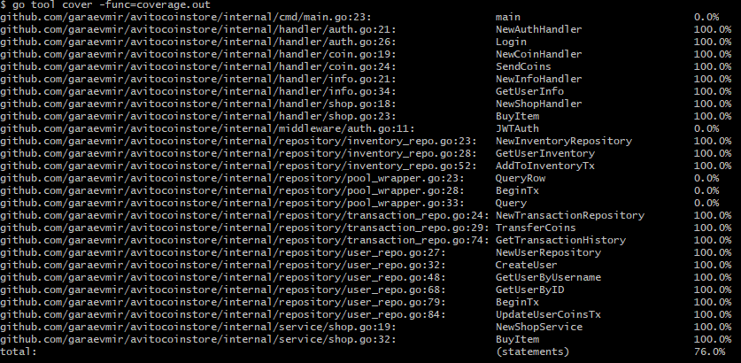

# Тестирование

## Юнит тесты

Для всех файлов из папок [handler](../internal/handler/), [repository](../internal/repository/) и [service](../internal/service/) написаны юнит тесты с использованием моков из папки [mocks](./mocks/).

Покрытие тестами составляет **>70%**. Результаты одного из последних тестирований:

Тесты можно воспроизвести следующей командой в директории [internal](../internal/):

    go test ./... -coverprofile=coverage.out

Флаг -coverprofile=coverage.out используется для формирования отчёта о покрытии тестов. Более подробную информацию о покрытии можно узнать используя:

    go tool cover -func=coverage.out

Именно эта команда использована на скрине выше, в ней -func можно заменить на -html для получения подробной детализации в html виде.

## Интеграционные тесты

Тест для проверки работы в рабочем состоянии лежит в папке [integration](./integration/) в единственном файле. Тест рассматривает разные сценарии обращения по [API](../static/schema.json) среди них есть как запрошенные в условиях покупка мерча, передача монет другим сотрудникам, получение информации о пользователе аутентификация пользователя и другие сценарии, некоторые из которых, были выявлены и впоследствии исправлены как раз в ходе тестирования.

Для проведения такого тестирования достаточно запустить сервер по инструкции из [основного руководства](../README.md), а затем запустить тест в директории integration при помощи следующей команды:

    go test

## Нагрузочное тестирование

Также мною было проведено нагрузочное тестирование, файлы для теста находятся в файле [stress.go](./stress/stress.go). Тестирование выполняется при помощи модуля vegeta.
